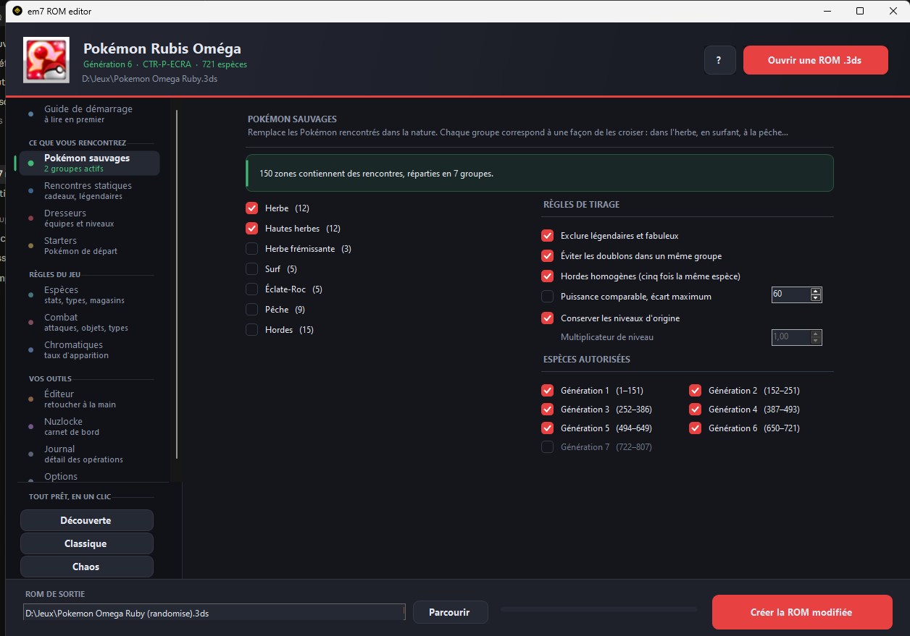
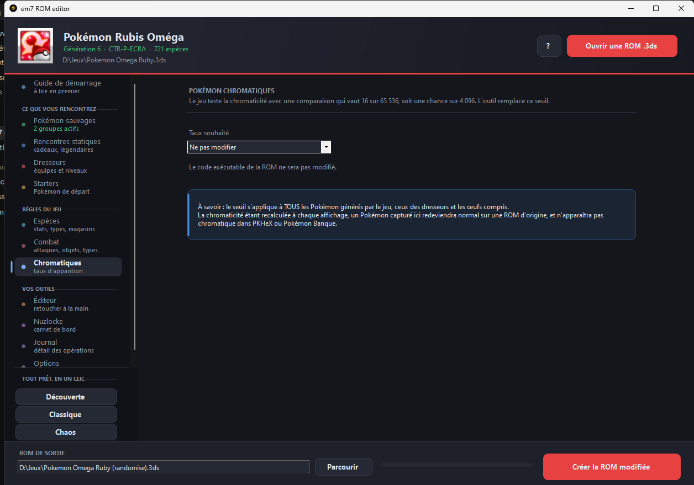
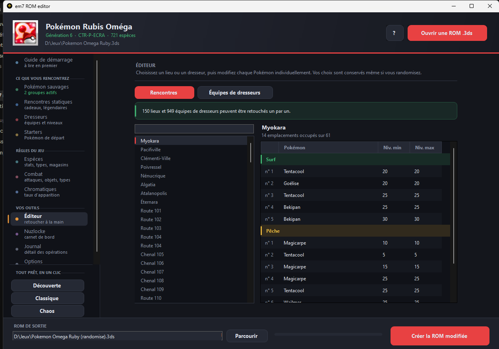
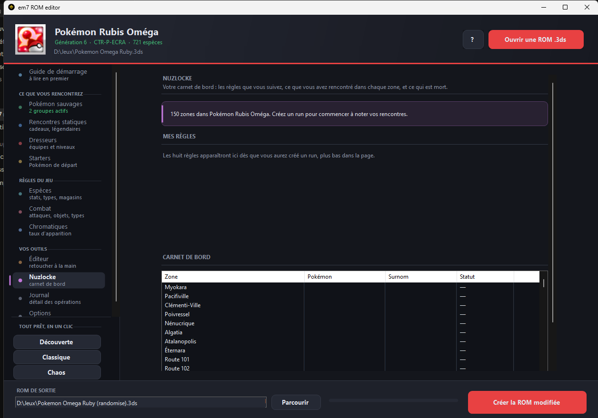

# em7 ROM editor

**Éditeur et randomizer de ROM Pokémon 3DS, en français.** Vous donnez une
ROM `.3ds`, vous récupérez une ROM modifiée prête à lancer dans l'émulateur.
Aucune extraction, aucune reconstruction : pas besoin de pk3DS ni de
HackingToolkit3DS.

📥 **[Télécharger la dernière version](../../releases/latest)** · 💬 **[Serveur
Discord](https://discord.gg/m85VtHVQAg)** · 🐛 **[Signaler un bug](../../issues)**



## Jeux pris en charge

| | Sauvages | Statiques | Starters | Dresseurs | Espèces | Magasins | Attaques | Types | CT/CS | Chromatiques |
|---|---|---|---|---|---|---|---|---|---|---|
| X / Y | oui | oui | oui | oui | oui | oui | oui | oui | oui | oui |
| Rubis Ω / Saphir α | oui | oui | oui | oui | oui | oui | oui | oui | oui | oui |
| Soleil / Lune | oui | oui | oui | oui | oui | oui | oui | oui | oui | oui |
| Ultra-Soleil / Ultra-Lune | oui | oui | oui | oui | oui | oui | oui | oui | oui | oui |

## Ce qu'on peut faire

- **Randomiser** : Pokémon sauvages, dresseurs, starters, statiques et cadeaux,
  objets et contenu des boutiques, attaques, CT/CS, types et table
  d'efficacité, talents, évolutions, statistiques (permutation à total
  constant)
- **Chromatiques** : taux réglable, de 1 sur 4096 jusqu'à 100 %
- **Nuzlocke** : carnet de bord — captures par zone, morts, huit règles
  hardcore décochables
- **Difficulté** : six niveaux qui pilotent l'ensemble des réglages
- **Seed reproductible** : même seed et mêmes options = exactement la même ROM,
  donc une partie se partage en un nombre
- **Styles de partie** enregistrables et échangeables (simples fichiers texte)

Le taux de chromatiques, avec le seuil réellement appliqué dans le code du jeu :



L'éditeur, pour retoucher une zone ou une équipe à la main sans rien
randomiser :



Le carnet Nuzlocke, avec les zones réelles du jeu chargé et les huit règles :



## Comment ça marche

Le programme ouvre le conteneur NCSD/NCCH, lit le système de fichiers RomFS,
décompresse ce qu'il faut (LZ11 pour les données, BLZ pour le code exécutable),
applique les réglages, recompresse, puis recalcule **toutes** les empreintes de
contrôle : sections de l'ExeFS, superblocs, et l'arbre de hachage IVFC du
RomFS.

Les modifications sont faites sur place — rien n'est déplacé dans le fichier.
Ça tient parce que la recompression est plus compacte que celle d'origine
(marge constatée : 700 octets sur le code de Rubis Oméga, 30 Ko sur l'archive
des zones). Si jamais ça ne tenait pas, le programme s'arrête avec un message
plutôt que de produire une ROM corrompue.

**Votre ROM d'origine n'est jamais ouverte en écriture.** Le programme produit
toujours un nouveau fichier. Avant de finaliser, il vérifie que la partie reste
jouable : starters capables d'attaquer, CS jamais randomisées, zones jamais
vidées, dresseurs pourvus.

## Installation

Aucune. Téléchargez l'archive, décompressez, lancez `em7 ROM editor.exe`.
Windows suffit : .NET Framework est déjà livré avec le système. Le programme
est portable, il n'écrit rien dans le registre.

**➡️ [Télécharger la dernière version](../../releases/latest)**

Vérifiez l'empreinte du fichier téléchargé — elle est publiée avec chaque
version :

```powershell
Get-FileHash "em7-ROM-editor-<version>.zip" -Algorithm SHA256
```

Windows affichera un avertissement bleu (« Windows a protégé votre
ordinateur ») : le programme n'est pas signé numériquement. *Informations
complémentaires* puis *Exécuter quand même*. Si vous préférez ne pas faire
confiance, vérifiez d'abord l'empreinte ci-dessus.

## Ce que ça ne fait pas

- Rien pour la DS ni la GBA — c'est la suite du programme
- Les échanges internes ne sont gérés qu'en 7e génération : aucune table
  équivalente n'a été trouvée en 6e
- Le talent Ramassage n'a de table dédiée qu'en 7e génération
- La signature RSA de la partition n'est pas recalculable sans la clé privée de
  Nintendo, comme avec tous les outils de ce type : ça se joue sur émulateur ou
  sur console avec patch de signature
- Ce n'est pas un patcheur de comportement du jeu : le carnet Nuzlocke suit
  votre partie, il ne force rien dans la ROM

## Fiabilité

Les quatre ROM testées ont été passées avec toutes les options activées d'un
coup, empreintes intégralement revérifiées et contenu relu à chaque fois.
60 contrôles automatisés tournent à chaque compilation. Le contrôle des
rencontres a été fait en décodant des lieux connus et en les comparant aux
Pokémon réellement présents dans le jeu — Route 2 de Kalos, Route 101 de
Hoenn, Route 1 de Mele-Mele.

## Signaler un bug

Ce qui permet de reproduire à l'identique : **le jeu, les options cochées, la
seed, et le journal affiché par l'application.** Avec ces quatre éléments, le
problème se rejoue exactement.

Ouvrez une [issue](../../issues) ici, ou passez par le serveur Discord :
https://discord.gg/m85VtHVQAg

## Aucune ROM n'est fournie

Ce dépôt ne distribue aucun jeu, aucune donnée extraite d'un jeu, et n'indique
pas où en trouver. Vous utilisez votre propre copie, que vous devez posséder.
Les demandes de ROM ne recevront pas de réponse.

## Licence

Logiciel propriétaire, gratuit pour un usage personnel. Voir
[LICENCE.txt](LICENCE.txt). Le code source n'est pas publié.

Ce projet n'est ni affilié à, ni approuvé par, ni associé à Nintendo, Game
Freak ou The Pokémon Company. Pokémon et les noms des jeux sont des marques de
leurs titulaires respectifs.

---

## In short (English)

**em7 ROM editor** is a French-language ROM editor and randomizer for the
Nintendo 3DS Pokémon games (X, Y, Omega Ruby, Alpha Sapphire, Sun, Moon, Ultra
Sun, Ultra Moon). It works directly on a decrypted `.3ds` file — no extraction,
no rebuild — and recomputes every checksum, including the RomFS IVFC hash tree.
The interface and documentation are in French only. **No ROMs are provided;
bring your own.**
